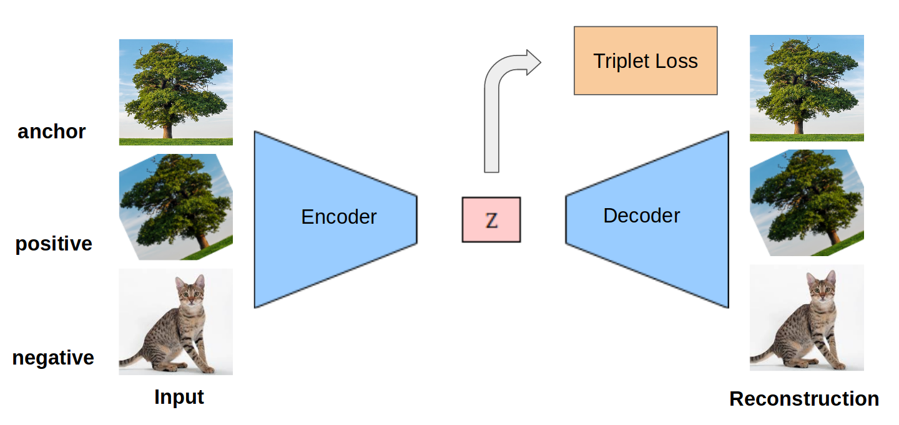

# Siamese-Regulated-Convolutional-Variational-Auto-Encoder

We introduce a Variational autoencoder with a siamese triplet loss on the latent space representation along KL loss and reconstruction loss, which are the usual loss terms used to train VAE. Inspired by the success of Siamese triplet loss for unsupervised learning from videos we decided to experiment this loss term with VAE. Triplet loss needs an anchor, a positive example and a negative example and tries to bring positive closer to the anchor than negative in terms of Euclidean distance in latent space. Since we did not have paired examples, we performed a random transformation (random crop, random flip, and random jittering) on the anchor image to get a positive example. The idea of maximizing the similarity between random transformations of the image for unsupervised learning is present in the literature.

This repository contains Pytorch implementation of semi-supervised image classification on low resource labelled data. Steps include:
- Unsupervised Siamese VAE training
- Transfer learning: extracting the features from VAE and training a feed forward classifer on top of them.
